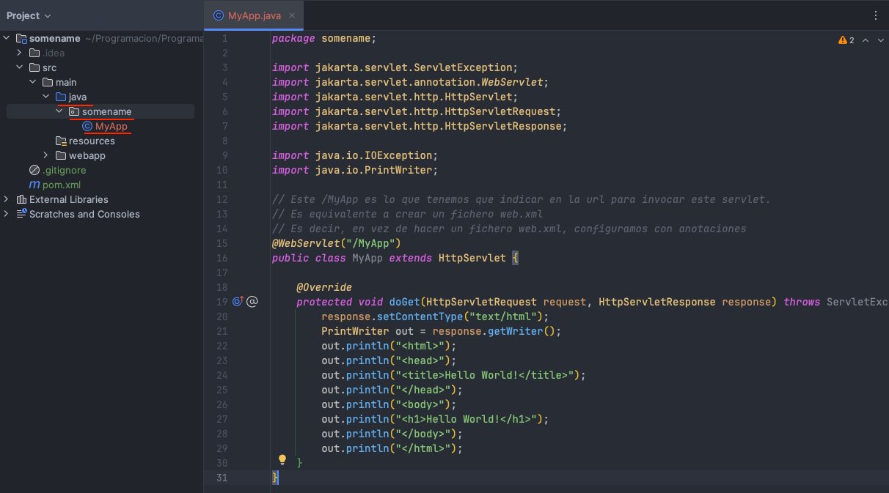
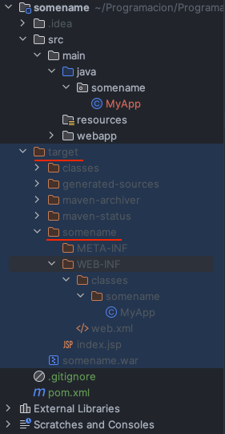
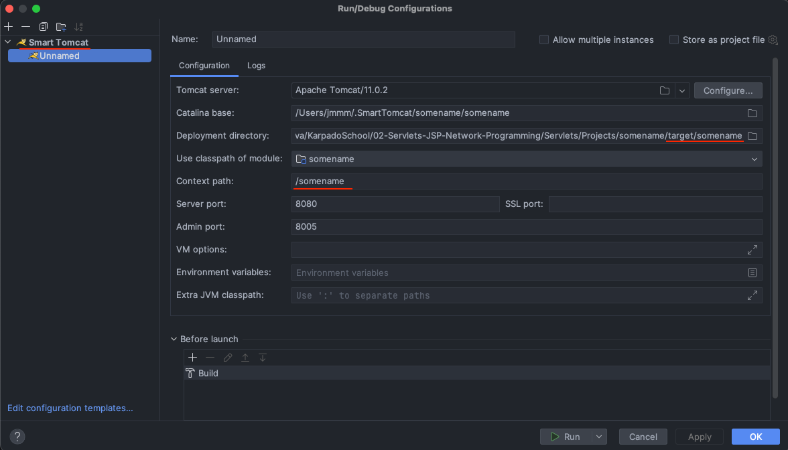
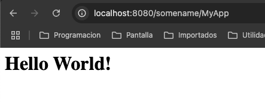
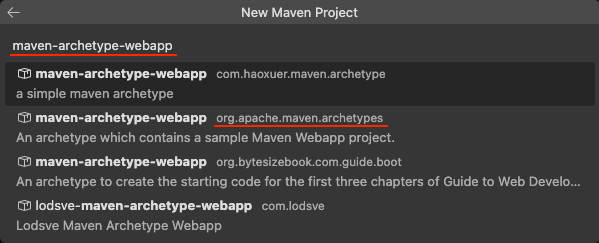
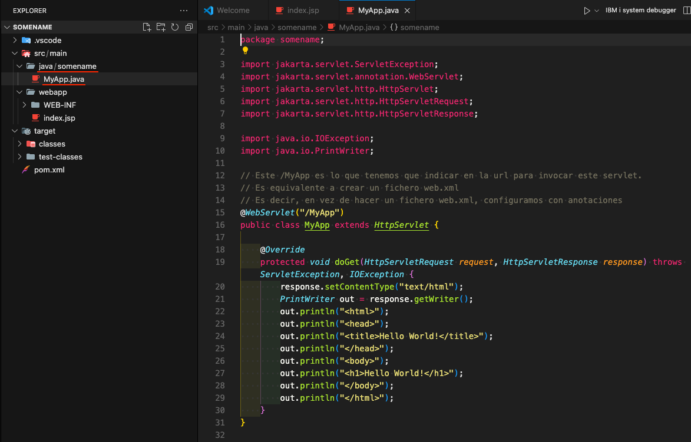
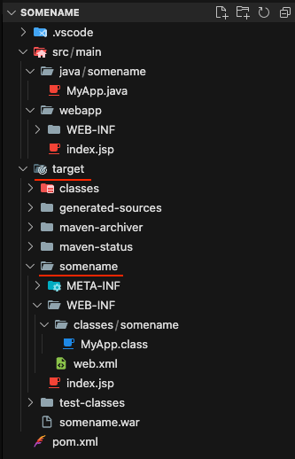
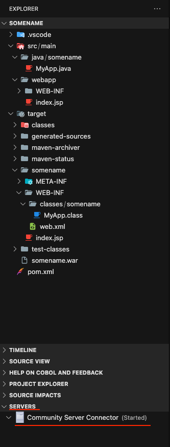
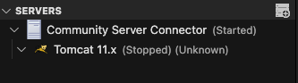

# Servlets

Los servlets son clases Java que se ejecutan en un servidor web, como Tomcat, que tiene la capacidad de interpretar y ejecutar código Java. Los servlets son utilizados para extender las capacidades de un servidor web, como responder a solicitudes de usuarios, realizar operaciones de entrada y salida, y generar respuestas dinámicas.

Los servlets containers son responsables de la creación de instancias de los servlets, de la invocación de los métodos de los servlets y de la destrucción de los servlets. También se les llama web containers o servlet engines.

Usando múltiples Threads se pueden atender múltiples solicitudes de manera concurrente.

Diagrama:

```
                        HTTP
  Client ---> Proxy ------------------> Web Server ---> Servlet Container
```

Indicar que esta tecnología, per se, ya no se usa en la industria, pero está embebido en los distintos Frameworks, como Spring, que lo usan internamente.

También indicar que, para una funcionalidad web muy pequeña, quizás usar Spring sea demasiado, y hacer un servlet puede ser la solución ideal.

## Setup and First Servlet

Vamos a hacer nuestro primer programa usando Servlets, un Hola Mundo.

Ver el proyecto `helloworld`.

Esto que se indica aquí es una forma manual de hacer las cosas, no recomendada pero interesante de conocer. Ver el punto `First Servlet in ItelliJ Idea and VSCode` para hacer lo mismo de manera más automatizada, usando el IDE.

Necesito ejecutar un servidor Tomcat.

- Yo ya tengo un servidor Tomcat externo en el directorio `/Users/jmmm/Programacion/tools/apache-tomcat-11.0.2/bin`
  - Abro una terminal y accedo a esa ruta
  - En la terminal ejecuto el comando `sudo bash catalina.sh run`
- En el navegador indico la URL `http://localhost:8080/`
  - Debe aparecerme la web de Apache Tomcat

Compilo el fichero java y lo llevo al servidor Tomcat.

- Uso el Lifecycle de Maven `compile`
  - Esto genera el archivo `App.class` en la carpeta `target/classes/helloword`.
- Voy a la carpeta de Tomcat `/Users/jmmm/Programacion/tools/apache-tomcat-11.0.2/webapps`
- Creo el directorio `servlet-hello-world`
  - IMPORTANTE: Dentro de este nuevo directorio creo otro directorio que tiene que llamarse obligatoriamente `WEB-INF` y dentro de este último directorio, creamos otro directorio que tiene que llamarse obligatoriamente `classes`
  - Como mi archivo `App.class` se creó en el package `helloworld`, dentro de la carpeta `classes` de Tomcat genero también la carpeta `helloworld`
- Creo un fichero vacío dentro de la carpeta `WEB-INF` llamado `web.xml`, que contiene información de nuestro servlet, con este contenido
  ```
  <web-app>

  <servlet>
    <servlet-name>somename</servlet-name>
    <servlet-class>helloworld.App</servlet-class>
  </servlet>

  <servlet-mapping>
    <servlet-name>somename</servlet-name>
    <url-pattern>/helloWorld</url-pattern>
  </servlet-mapping>

  </web-app>
  ```
- Copio el archivo `App.class` a esa carpeta `classes/helloworld`

Ahora ya ejecuto mi programa en el navegador

- Abrir el navegador e indicar la ruta siguiente (basado en web.xml y el nombre del directorio en Tomcat) `http://localhost:8080/servlet-hello-world/helloWorld`

## Servlet Life Cycle

Ver el documento [LifeCycle](./lifecycle.txt)

Cuando indico mi ejemplo, me refiero al ejemplo `helloworld` anterior.

## First Servlet in IntelliJ Idea and VSCode

Ver proyecto `somename`.

Aquí se indica como llevar al servidor Tomcat y ejecutar un servlet usando ambos IDEs.

**IntelliJ Idea**

- Pulsar el botón `New Project` para crear un nuevo proyecto
- Seleccionar Maven Archetype
  - En la parte derecha indicar como Name `somename`, en JDK indicar cualquier Java 21 y en Archetype seleccionar `org.apache.maven.archetypes:maven-archetype-webapp`
  - Pulsar en Advanced Settings y tanto en GroupId como en ArtifactId indicar `somename`
  - Pulsar el botón `Create`
- Añadir al POM la siguiente dependencia
  ```
    <dependency>
      <groupId>jakarta.servlet</groupId>
      <artifactId>jakarta.servlet-api</artifactId>
      <version>5.0.0</version>
      <scope>provided</scope>
    </dependency>  
  ```
- Eliminar el contenido del fichero `index.jsp`
  - También se puede eliminar el fichero en vez de solo el contenido, pero lo dejamos vacío
- En la parte donde se ve el proyecto, en el directorio `src/main` crear el directorio `java` y dentro el package `somename`
  - Crear dentro la clase `MyApp.java`. Tiene que quedar como en la imagen
  - 
- Del Lifecycle de Maven seleccionamos `install`. Esto genera en el directorio `target` los siguientes ficheros, que son los que se desplegarán en Tomcat
  - 
  - Notar que aunque hay un fichero `index.jsp`, lo hemos dejado vacío antes
- Vamos a Editar Configuración e indicamos los valores tal y como se ve en la imagen:
  - 
  - Notar que como Deployment Directory indicamos el directorio `target/somename` y Context path sería `/somename`
- Ejecutamos el proyecto y pulsamos el enlace que aparece, en mi ejemplo `http://localhost:8080/somename`
  - Veremos que no aparece nada. Hay que ir realmente a la ruta `http://localhost:8080/somename/MyApp` ya que en el fuente `MyApp.java` se indicó el decorador `@WebServlet("/MyApp")`
  - 

Indicar que el deploy se hace en la carpeta situado en la raiz del usuario, en mi caso en `jmmm/.SmartTomcat`

**VSCode**

- Pulsar el botón `Create Java Project`
- Seleccionar `Maven create from archetype`
  - Pulsar `More...`, buscar `maven-archetype-webapp` y seleccionar el de Apache, tal y como se ve en la imagen
  
  - Seleccionar la versión 1.4 y como nombre de groupId y de artifactId indicar `somename`
  - Elegir en que carpeta se quiere crear el proyecto
- Añadir al POM la siguiente dependencia
  ```
    <dependency>
      <groupId>jakarta.servlet</groupId>
      <artifactId>jakarta.servlet-api</artifactId>
      <version>5.0.0</version>
      <scope>provided</scope>
    </dependency>
  ```
- La versión de Java que se indica es la 1.7. Cambiar a la 21
  ```
    <properties>
      <project.build.sourceEncoding>UTF-8</project.build.sourceEncoding>
      <maven.compiler.source>21</maven.compiler.source>
      <maven.compiler.target>21</maven.compiler.target>
    </properties>
  ```
- Eliminar el contenido del fichero `index.jsp`
  - También se puede eliminar el fichero en vez de solo el contenido, pero lo dejamos vacío
- En la parte donde se ve el proyecto, en el directorio `src/main` crear el directorio `java` y dentro el package `somename`
  - Crear dentro la clase `MyApp.java`. Tiene que quedar como en la imagen
  - 
- Del Lifecycle de Maven seleccionamos `install`. Esto genera en el directorio `target` los siguientes ficheros, que son los que se desplegarán en Tomcat
  - 
  - Notar que aunque hay un fichero `index.jsp`, lo hemos dejado vacío antes
- Accedemos a SERVERS y añadimos nuestro Apache Tomcat usando `Community Server Connector`
  - 
  - Pulsamos con el botón derecho en `Community Server Connector` y seleccionamos `Create New Server...`
    - En la opción `Download server?` seleccionamos `No, use server on disk`
    - Yo tengo mi Apache Tomcat en la ruta `/Users/jmmm/Programacion/tools/apache-tomcat-11.0.2`
    - En la ventana que aparece no tocamos nada y pulsamos el botón `Finish`
    - Con esto aparece nuestro server Tomcat
    - 
- Pulsamos con el botón derecho en Tomcat 11.x y seleccionamos `Start Server`
  - El server debe iniciarse
- Pulsamos con el botón derecho en Tomcat 11.x y seleccionamos `Add Deployment`
  - Seleccionamos de nuestro proyecto la carpeta `target/somename` y pulsamos el botón `Select file or exploded Deployment`
    - Indicar que también podemos seleccionar el fichero `.war` generado y que este nos generará en Tomcat todos los directorios automáticamente (WEB-INF, ...)
  - A la pregunta de si queremos editar parámetros del deployment contestamos que no.  
- Pulsamos con el botón derecho en Tomcat 11.x y seleccionamos `Server Actions...`, luego seleccionamos `Show in browser...` y por último seleccionamos `http://localhost:8080/somename`
  - Veremos que aparece un error. Hay que ir realmente a la ruta `http://localhost:8080/somename/MyApp` ya que en el fuente `MyApp.java` se indicó el decorador `@WebServlet("/MyApp")`
  - 

Indicar que el deploy se hace realmente en mi instalación de Apache Tomcat, en `/Users/jmmm/Programacion/tools/apache-tomcat-11.0.2/webapps`

## Cookie With Servlets

Una cookie es un fichero con data representada como un par clave-valor que se almacena en el ordenador del cliente y que se manda al servidor para realizar acciones.

Ver proyecto `cookieexample` que contiene dos servlets, `CookieExample.java` y `SetCookies.java`.

**Testing**

Se ha generado el proyecto con VSCode y se ha hecho el deploy a Tomcat siguiendo los pasos arriba indicados.

Con el server ejecutándose acceder a la ruta `http://localhost:8080/cookieexample/CookieExample`

Al indicar un nombre y pulsar el botón accederemos al otro servlet automáticamente, que está en la ruta `http://localhost:8080/cookieexample/SetCookies`. Aquí se genera la cookie.

Luego, si volvemos a ejecutar la primera ruta, se lee la cookie y aparecerá nuestro nombre.

## Add Two Numbers Example

Ver proyecto `addtwonumbers` que contiene el servlet `AddTwoNumbers.java`.

Además, en la carpeta `webapp` tenemos el formulario `AddTwoNumbers.html`.

El objetivo de este ejemplo es ver como tratar parámetros de entrada. En este caso los parámetros de entrada proceden del formulario y entran a nuestro servlet.

**Testing**

Se ha generado el proyecto con VSCode y se ha hecho el deploy a Tomcat siguiendo los pasos arriba indicados.

Con el server ejecutándose acceder a la ruta `http://localhost:8080/addtwonumbers/AddTwoNumbers.html` (el form)

Indicar dos números y confirmar que el servlet los suma correctamente.

## Filters

Ver proyecto `filterexample` que contiene los servlets `Filter.java`, `CookieExample.java` y `SetCookies.java`.

Cuando un container recibe un request, este chequea `web.xml` o el deployment descriptor o, en nuestro caso, la anotación `@WebServlet`, y con esto el container puede saber como avanzar la request.

Hasta ahora, el container llevaba la request directamente al servlet, pero también es posible que lo lleve primero a un filtro.

Un filtro es algo que parece un servlet, pero cuya misión es chequear la request y confirmar si realmente debe ir o no al servlet.

Un ejemplo típico es, un usuario logeado intenta acceder a la página de login, cuando el sistema no debería dejarle, sino que debe acceder ya al interior del sistema.

Un fichero `web.xml` que tenga un filtro se indica de la siguiente forma:

```
<filter>
  <filter-name>LogFilter</filter-name>
  <filter-class>LogFilter</filter-class>
</filter>

<filter-mapping>
  <filter-name>LogFilter</filter-name>
  <url-pattern>/*</url-pattern>
</filter-mapping>
```

En este ejemplo, indicando `<url-pattern>/*</url-pattern>`, el filtro se ejecuta antes de acceder a cualquier servlet.

Indicar que también se puede usar el concepto de filtro cuando se envía la response de vuelta al cliente.

**Testing**

Se ha generado el proyecto con VSCode y se ha hecho el deploy a Tomcat siguiendo los pasos arriba indicados.

Con el server ejecutándose acceder a la ruta `http://localhost:8080/filterexample/CookieExample`.

Si se indica el nombre `hacker` el filtro impedirá que llegue a guardarse la cookie. Con cualquier otro nombre se creará la cookie.

## Maintaining Sessions

Ver proyecto `servletsessions` que contiene los fuentes `SessionExample.java` y `SetSession.java`.

Una sesión es un mecanismo que permite conservar la información sobre un usuario (en un servidor) al pasar de una página a otra.

Recordar que el protocolo HTTP es stateless, es decir, no mantiene estado, por eso, o bien lo guardamos en el cliente (cookies) o los guardamos en el servidor (sesión).

El problema de las cookies es que no podemos guardar información sensible en el ordenador del cliente, como passwords, etc.

Es para esto que se crea en el servidor un objeto Session, que se asocia a un único cliente. Ocultamos información importante a posibles hackers.

Cuando un cliente hace una petición a un servidor, en este se crea/recupera su información de sesión, llamando al método `r.getSession()` siendo `r=request`. Este método devuelve la información de sesión como un par clave-valor que se almacena en el objeto Session.

Si el servidor no recibe peticiones del cliente por un cierto tiempo, el objeto Session se destruye y la sesión del cliente termina.

**Testing**

Se ha generado el proyecto con VSCode y se ha hecho el deploy a Tomcat siguiendo los pasos arriba indicados.

Con el server ejecutándose acceder a la ruta `http://localhost:8080/servletsession/SessionExample`.

Si se indica, por ejemplo, el nombre `apple` (o cualquiera) veremos que navega a `SetSession`, se guarda ese nombre en el objeto Session y en el navegador aparecen datos de la sesión. Si volvemos a acceder a la ruta `http://localhost:8080/servletsession/SessionExample`, aparecerá directamente el nombre `apple`, ya que lo recupera del objeto Session. 

## Create War File

Para crear un fichero `.war` se puede usar el lifecycle de Maven `install` o el comando `jar -cvf projectname.war *`.

## Handling Exceptions

La forma de manejar excepciones usando el fichero `web.xml` es algo así:

```
<error-page>
  <error-code>404</error-code>
  <location>/ErrorHandler</location>
</error-page>

<error-page>
  <error-code>403</error-code>
  <location>/ErrorHandler</location>
</error-page>

<error-page>
  <exception-type>java.io.IOException</exception-type>
  <location>/ErrorHandler</location>
</error-page>
```

Este código indica que, cuando ocurra una excepción de tipo `IOException` o sean status HTTP 403 o 404, redirija a la dirección `/ErrorHandler` de forma que el cliente tenga una mejor experiencia de uso.

## Locale

Para mostrar una web en un idioma determinado, hace falta conocer las preferencias de idioma y el país de origen del cliente. Esto se puede obtener de la siguiente forma:

```
Locale locale = request.getLocale();
String language = locale.getLanguage;
String country = locale.getCountry();
```

Tenemos un ejemplo de esto en la sección sobre `JSP`.

## Annotations

Como hemos visto en los distintos proyectos, las anotaciones de servlets sustituyen al fichero `web.xml`.

En el fichero de links indicados al final de este documento pueden verse todas las anotaciones existentes.

## Links

Ver el documento [Links](links.txt)
